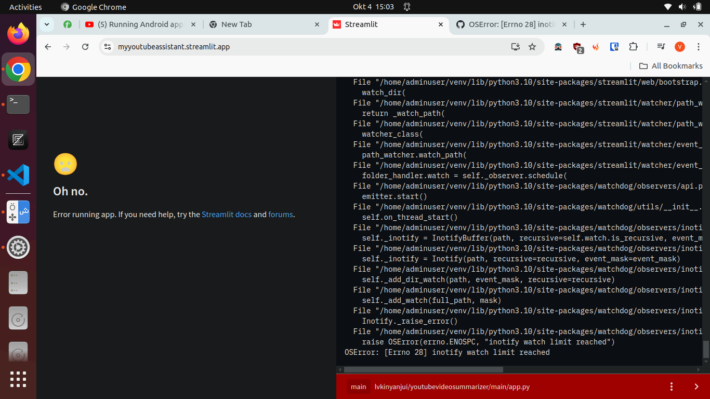

# What is this?

This project uses either a streamlit interface to allow us to interact with youtube video data.
We provide the youtube video url and get all the comments from the Youtube Data API.

### Summary
A summary feature has been added that uses the refine technique on all the extracted comments.

### Difficulties
Sometimes the build process on streamlit.io has failed with this error

.

This is supposedly due to the project's root directory being cluttered. The main file is meant to be moved to its own subdirectory in future.